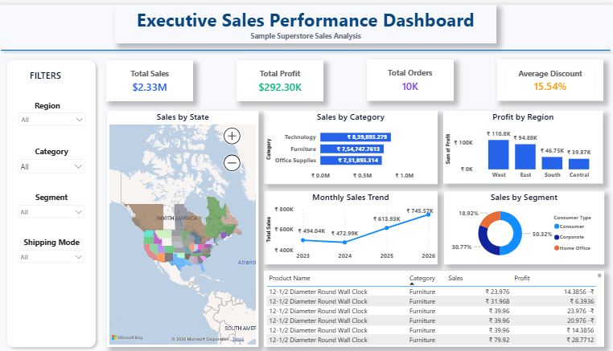
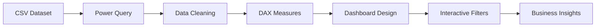

# 📊 Executive Sales Performance Dashboard


An executive-level **Power BI dashboard** built using the **Superstore Sales Dataset**. The dashboard provides interactive KPIs, geographical analysis, sales trends, profitability insights, customer segmentation, and detailed product information.

---

# 📸 Dashboard Preview




---

# 🎯 Project Objective

Design a clean, professional executive dashboard that enables business users to:

- 📈 Track Total Sales, Profit, Orders and Discount
- 🌎 Analyze sales geographically
- 📊 Compare performance by Category and Region
- 📅 Monitor monthly sales trends
- 👥 Analyze customer segments
- 🔍 Filter data interactively

---

# ✨ Dashboard Features

## KPI Cards
- 💰 Total Sales
- 💵 Total Profit
- 📦 Total Orders
- 🏷️ Average Discount

## Interactive Filters
- Region
- Category
- Segment
- Shipping Mode

## Visualizations
- 🗺️ Sales by State (Map)
- 📊 Sales by Category
- 📈 Profit by Region
- 📉 Monthly Sales Trend
- 🍩 Sales by Segment
- 📋 Top Products Table

---

# 🧹 Power Query Transformations

- Renamed columns
- Corrected data types
- Fixed date locale
- Verified null values
- Loaded cleaned dataset into Power BI

---

# 🛠️ Tools & Technologies

| Tool | Purpose |
|------|---------|
| Power BI Desktop | Dashboard Development |
| Power Query | Data Cleaning |
| DAX | Measures |
| Git & GitHub | Version Control |
| CSV | Data Source |

---

# 📂 Repository Structure

```text
PR1/
├── Screenshot/
│   └── Dashboard.png
├── Video/
├── samplesuperstore.csv
├── Super_Store_Sales.pbix
└── README.md
```

---

# 🔄 Project Workflow



---

# 📊 Key Business Insights

- Technology generates the highest sales.
- Regional profitability varies significantly.
- Consumer customers contribute the largest share of sales.
- Monthly sales show an overall upward trend.
- Geographic visualization identifies high-performing states.

---

# 🚀 How to Use

1. Clone the repository.
2. Open **Super_Store_Sales.pbix** in Power BI Desktop.
3. Refresh the data if needed.
4. Use the slicers to filter the dashboard.
5. Interact with visuals for cross-filtering.

---

# 📁 Dataset

- Dataset: Superstore Sales
- Format: CSV
- Rows: ~10,000
- Source: Kaggle

---

# 🎨 Dashboard Design Highlights

- Executive-style layout
- Premium blue & white theme
- Soft shadows
- Interactive visuals
- Single-page dashboard

---

# 📈 Future Improvements

- Drill-through pages
- Bookmarks
- Power BI Service publishing
- Forecasting
- Row-Level Security

---

# 💻 Git Commit History

- Initial project setup
- Added KPI cards and filters
- Completed dashboard
- Added README and screenshots

---

# 👨‍💻 Author

**Dushyant V**

Aspiring Data Analyst | Power BI Developer

---

⭐ If you found this project helpful, consider starring the repository!
